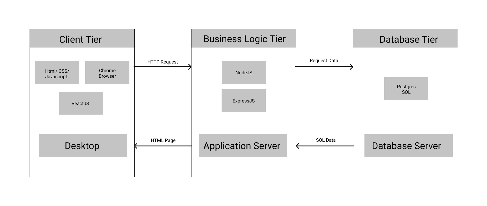
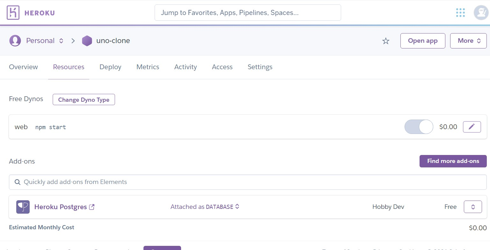
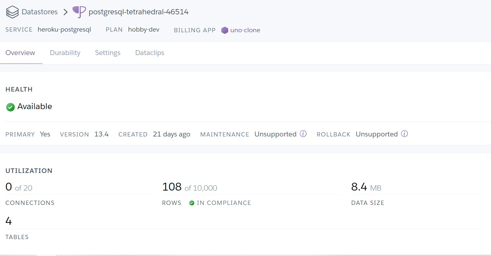
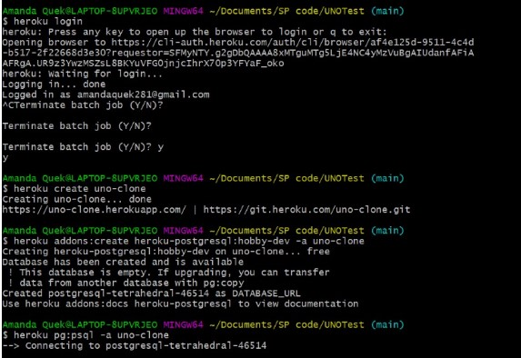

# UNO-Clone PERN Project
This is our CA1 Project on UNO-Clone, created as a PERN project and hosted in heroku.
P - Postgres 
E - Express
R - React
N - Nodejs

Visit out website here : https://uno-clone.herokuapp.com/

## Architecture

### PostgresSQL Database

#### Set up Database
sql
CREATE DATABASE uno_clone;

#### Set Up Postgres SQL Table 
sql
CREATE TABLE uno_cards;

#### Database commands
bash
# To get into the database 
psql -U postgres

sql
\l => list all databases in postgrea

\c => enter the specific database

\dt => show tables in database

## Express Backend Framework with Node.js

#### Setting Up Server
Starting and setting up our server
bash
mkdir server
cd server
npm init

#### Require Express, CORS and pg libraries
Creating the server with express framework
bash
touch index.js
npm install express pg cors

#### Setting up database connection with pool and pg

js
const devConfig = {
    user: process.env.PG_USER,
    password: process.env.PG_PASSWORD,
    host: process.env.PG_HOST,
    port: process.env.PG_PORT,
    database: process.env.PG_DATABASE
}

This will tell the server to determine which configuration to use in devlopment and in production. 

#### Creating routes and set up API calls

## React Front End Library

#### Set up client 
bash
npx create-react-app client
 
bash
npm start

## Deployment

#### Configure server files
Heroku requires the package.json file in root directory as it will be instructions for heroku.
Therefore, our server files will be moved to the top level directory.

In our reactJS frontend, we have to create a build folder for the server to tell heroku to run
bash
npm run build

#### Run static content on server

To tell our server to run static content in production, we will do
 bash
if (process.env.NODE_ENV === "production") {
    app.use(express.static(path.join(__dirname, "client/build")));
}

This tells the express server to use the static directory which points to the build folder in client when in production

#### Set up pool configuration in production
We will also hide our environment variables with process.env
This is done with .env and .gitignore file
 bash
npm i install dotenv

To create Pool connection based on local database and heroku database, we will seperate the configuration by using
bash
const Pool = require("pg").Pool;
require("dotenv").config();

const devConfig = {
    user: process.env.PG_USER,
    password: process.env.PG_PASSWORD,
    host: process.env.PG_HOST,
    port: process.env.PG_PORT,
    database: process.env.PG_DATABASE
}

const proConfig = {
    connectionString: process.env.DATABASE_URL // heroku addons
}

const pool = new Pool(process.env.NODE_ENV === "production" ? proConfig : devConfig);

#### Configuring scripts for heroku to run
In package.json, specify codes for heroku to run while building project for deployment
bash
"scripts": {
  "start": "node index.js",
  "heroku-postbuild": "cd client && npm install && npm run build"
},

Order of heroku deployment
1) run the prebuild script before dependencies are installed
2) npm install will run to install dependencies
3) heroku-postbuild script is then run after dependencies are installed
4) start script is run for server to start

#### Seperating access to backend api in development and production with proxy
Proxy will help production by using heroku domain when accessing backend api instead of localhost
In package.json, specify codes for heroku to run while building project for deplyment
bash
"proxy": "localhost:5000"

As the heroku app will serve our static build content along with restful api, we can specify endpoints through paths. However, in development, we have to specify the backend URL so the proxy will do its job here for easy editing in development

#### Add engines to determine versions of node and npm
bash
"engines": {
  "node": "15.0.0",
  "npm": "7.0.2"
},

## Ready for deployment

#### Heroku Create application
bash
heroku login
heroku create uno-clone

#### Heroku set up free postgres database
Add addons for postgres database service for heroku application
bash
heroku addons:create heroku-postgresql:hoddy-dev -a uno-clone

#### Heroku deploy code to production in heroku
bash
heroku pg:psql -a uno-clone
heroku git:remote -a uno-clone
heroku open

